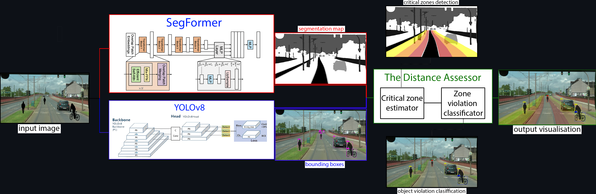
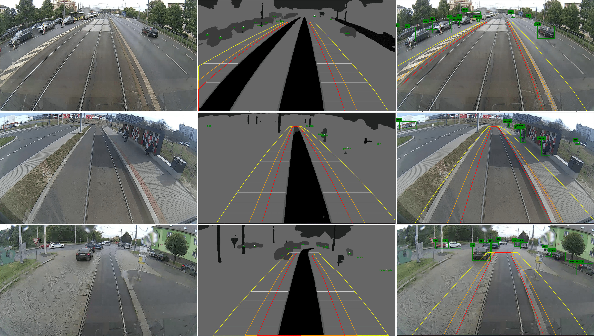

# RailSafeNet - Automatic Detection of Objects in the Track

  

This repository includes the code used for RailSafeNet pipeline develoment. This pipeline was developed for the master's thesis **Automatic Detection of Objects in the Track from the Recording** by author [Ondřej Valach](https://github.com/oValach), supervised by [Ivan Gruber](https://github.com/YvanG). This thesis is accessible from [Theses](https://theses.cz/id/03nn2a/?lang=en).  

**The complete real life visualisation footage accesible from [footage](https://drive.google.com/file/d/1JHW8TfCtTTjQT848u3zUgqLuxSan3gMt/view?usp=sharing).**

## About
The directory `assets` includes folder `models_pretrained`. That is a directory for fine-tuned weights of SegFormerB3 and Yolov8s models accessible from shared [Google Drive](https://drive.google.com/drive/folders/1AQhm0MKCSb5tdghZgb_GEbpc8lYRepHp?usp=sharing). Other folders include used datasets for the model finetuning (RailSem19 and Pisel Railway Dataset) with information on the structure.

Folder `scripts` includes additional scripts called by main scripts in the repository base.

The architecture pipeline of the whole system uses both SegFormerB3 and Yolov8 for rails and objects localisation. Results are further processed by The Distance Accessor. The output of this step can be seen on the introductory gifs.



## Installation
Create a conda environment where the script will be run from:
```
conda create -n RailSafeNet
conda activate RailSafeNet
```

Install package dependencies:

```
pip3 install torch torchvision torchaudio --index-url https://download.pytorch.org/whl/cu118
pip install -r assets/requirements.txt
```

## Execution
For the one data sample inference, run `TheDistanceAccessor.py` script. Check the input parameters of function `run` before the execution and set it up according to your needs.

## Demo example

The HuggingFace demo is accessible from [here](https://huggingface.co/spaces/oValach/RailSafeNet-app)


